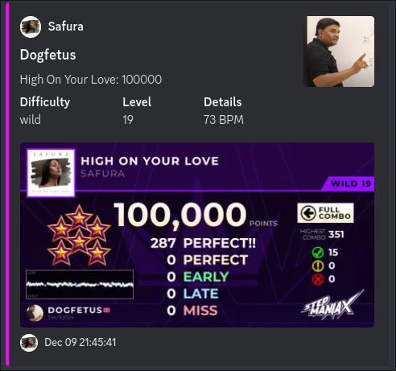

# StepManiaX Discord Embed Generator

This project generates Discord embeds for StepManiaX (SMX) gameplay results, displaying song details, performance stats, and highlights.

## Features
- **Discord Embed Integration**: Posts performance stats automatically.
- **Detailed Stats**: Song name, difficulty, BPM, score, and breakdown (perfects, misses, etc.).
- **Full Combo Recognition**: Highlights perfect runs.

## Setup
1. **Clone**:  
   ```bash
   git clone <repository_url>
   cd <repository_directory>
   ```
2. **Configure**: `.env` needs tokens (will update later)
3. **Run**:  
   ```bash
   docker compose up -d
   ```

## Example Embed

